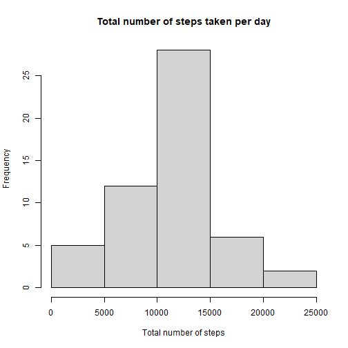
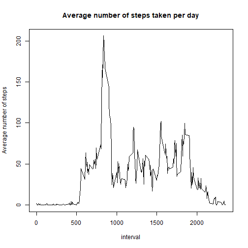
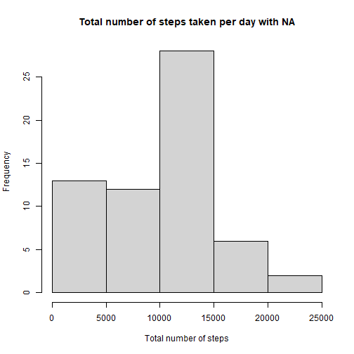
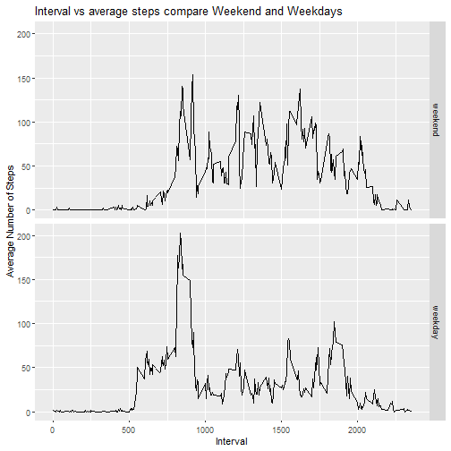

## R Markdown

This is an R Markdown document. Markdown is a simple formatting syntax for authoring HTML, PDF, and MS Word documents. For more details on using R Markdown see <http://rmarkdown.rstudio.com>.

When you click the **Knit** button a document will be generated that includes both content as well as the output of any embedded R code chunks within the document. You can embed an R code chunk like this:


```r
library(ggplot2)
library(dplyr)

setwd("/Users/hyeaw/Desktop/Coursera/Reproducible Research/week 2/repdata_data_activity")
###1. reading in the dataset and/or processing the data

repdata<- read.csv(file = "activity.csv")

###2. Histogram of the total number of steps taken each day steps.

repdata$date <- as.Date(repdata$date)
newdata<-na.omit(repdata) 
groupday<-group_by(newdata, date)
stepsbydays<-summarize(groupday, steps = sum(steps))
hist(stepsbydays$steps, main = "Total number of steps taken per day", xlab = "Total number of steps")
```



```r
###3. Mean and median number of steps taken each day

mean(stepsbydays$steps)
```

```
## [1] 10766.19
```

```r
median(stepsbydays$steps)
```

```
## [1] 10765
```

```r
###4. Time series plot of the average number of steps taken

groupinterval<-group_by(newdata,interval)
stepsbyinterval<-summarize(groupinterval, steps = mean(steps))
plot(stepsbyinterval$interval, stepsbyinterval$steps, type="l", main = "Average number of steps taken per day",xlab = "interval", ylab = "Average number of steps")
```



```r
###5. The 5-minute interval that, on average, contains the maximum number of steps

groupinterval<-group_by(newdata, interval)
which.max(stepsbyinterval$steps)
```

```
## [1] 104
```

```r
###6. Code to describe and show a strategy for imputing missing data

repdata1 <- repdata %>% replace(is.na(.), 0)
IncludeNAgroupday<-group_by(repdata1, date)
includeNAstepsbydays<-summarize(IncludeNAgroupday, steps = sum(steps))
averageincludeNAstepsbydays<-summarize(IncludeNAgroupday, steps = mean(steps))

mean(includeNAstepsbydays$steps)
```

```
## [1] 9354.23
```

```r
median(includeNAstepsbydays$steps)
```

```
## [1] 10395
```

```r
###7. Histogram of the total number of steps taken each day after missing values are imputed

hist(includeNAstepsbydays$steps, main = "Total number of steps taken per day with NA", xlab = "Total number of steps")
```



```r
###8. Panel plot comparing the average number of steps taken per 5-minute interval across weekdays and weekends

repdata1$days <- weekdays(repdata1$date)
weekdays<-c('Monday', 'Tuesday', 'Wednesday', 'Thursday', 'Friday')
repdata1$wDay <- factor((weekdays(repdata1$date) %in% weekdays), 
                    levels=c(FALSE, TRUE), labels=c('weekend', 'weekday'))

averagedincludeNAgroupdate <- aggregate(steps ~ interval + wDay, data= repdata1, mean)
ggplot(averagedincludeNAgroupdate, aes(interval, steps))+geom_line()+facet_grid(wDay ~ .)+labs(title="Interval vs average steps compare Weekend and Weekdays", x="Interval", y="Average Number of Steps")
```



```r
knit2html("PA1.template.Rmd")
```

```
## Warning in file(con, "r"): cannot open file 'PA1.template.Rmd': No such file or directory
```

```
## Error in file(con, "r"): cannot open the connection
```

## Including Plots

You can also embed plots, for example:


Note that the `echo = FALSE` parameter was added to the code chunk to prevent printing of the R code that generated the plot.
